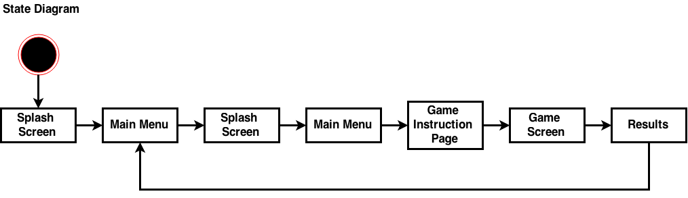

#Final Presentation: 
In week 13, you will present the final product to the instructors and the classmates. You are expected to present.
the software development process employed in your project;
a live demo of your app;
and the hiccups and lessons learned through your project.
Final Deliverable: You will deliver a self-contained package of the app, including: 

(A) the code itself; (B) installation and user manuals;
(C) a report detailing what are the system requirements, how are the system designed, how are the system evaluated/tested. In particular, we would like to know how you ensure your implementation is thread/safe. (D) a separate report, delivered by individual group member on contribution of every member in the group.
 Scoring
Presentation and Demonstration of the APP (40%): Score by the classmates (10%); Score by the instructors and/or external judges (30%)
Report/Code (60%): Clear documentation of the system requirements (10%); Clear documentation of the system design (15%); Code structure (15%); Clear documentation on how the system is tested (10%); Clear explanation on how concurrency issues are handled or avoided (10%)

```
Markdown is an easy way to format a document HTML style. 
Wonderfully simple Markdown syntax: https://github.com/adam-p/markdown-here/wiki/Markdown-Cheatsheet#headers

paste document into this to view result: http://dillinger.io
We use markdown because it makes display of code(with syntax highlighting!) and quotes extremely easy. 
 ```

#1. Introduction `Anusha`
###Purpose
The purpose of this report is to document the requirements and design process for creating a multiplayer android game for 50.003 Elements of software construction.
###Goals and Objectives
To make full use of the software design practices and methods to handle concurrency that we have learnt during 50.003 Elements of Software Construction to build a multiplayer game that can be played by two or more people at the same time.
###Project Scope
We are to implement our game on the Android Operating System. The game is to be played on mobile devices that run on Android and two or more players should be able to play the game concurrently with one another.
###Operating System
The game will run on Android 4.0 and above. All devices that are running on this version of android or later will be able to support the application. The game is developed using Android Development Tool (ADT) and hosted on an external server.
###Design and Implementation Constraints
The game must run on Android operating System only. All designs of the game are limited by the constraints provided by ADT such as restrictions on the file size and memory. The game must also be able to support two or more users playing the game concurrently. [Hardware restrictions etc]
###Assumptions and dependencies
* The end user must have a mobile phone running Android 4.0 or higher
* The mobile phones used by end users must be connected to the internet throughout the duration of gameplay. 
* [THINK OF MORE]

 
#2. Game – Galactical Real Estate `Anusha`
###2.1 Game Overview
‘Galactical Real Estate’ is a two-player grid based game, which involves conquering as many planets as you can in 90 seconds. Two players will start by choosing their planet avatars before entering the battle arena. Once inside the battle arena, players will compete on a 5 x 7 grid of planets to conquer as many planets as they can within 90 seconds. To conquer a planet, players must tap the grid button with the lowest number in order to change it to their chosen planet avatar. Power-ups will appear randomly on the grid to help players gain an advantage over their opponent. The player with the most number of planets conquered at the end of 90 seconds wins. 
###2.2 Game Design process 
#####Agile Development
Our group adopted the agile development model for the design and implementation of the game. Agile development is a combination of rapid prototyping as well as iterative and incremental development. We started off by outlining system requirements and a brief overview of the system design. we then created the first prototype of our game which consisted only of the grid with numbers. The game was single player at the time as the server-client portion of the code had not been implemented. Our next prototype consisted of the starting page, game grid and results page with the server-client component implemented as well. Two users could now play the game with one another. 

After gathering feedback from our peers on the initial prototypes, we implemented power ups as well as replaced ‘number of lives’ with a health bar to indicate how much of the grid was under each player’s possession. We continued to tweak the features and updated game graphics as well as sound effects, animation and music with subsequent prototypes. Receiving feedback from our instructors as well as peers on each prototype provided us with valuable information such as feedback on how we could improve user experience and prolong gameplay. With each iteration, we also adjusted our initial set of requirements and ensured our design fit the scope of the project. 

###2.3 Game Functionality
#####start Screen

Our game starts out by displaying the application’s name, Galactical Real-estate and introducing the user with the space theme for the first time. We have intended to stick to the minimalistic design philosophy where graphics and layout was concerned. 

#####Avatar Page

Here, players can choose their planet avatar. This will help them differentiate their teritory from their opponent’s. 


#####Waiting for player

Once an avatar is selected, the player waits for another player to select their avatar and join their game.


#####Instruction page

A connection between two players has been established and the game is about to start. There is a reminder for the players that they need to tap the smallest number in order to claim galactical real-estate.


#####Game grid

The game grid is concurrent for both players - they’re playing against each other on the same grid. Each game lasts for 90 seconds with a countdown timer on top to indicate how much time players have left. The health bar on the top of the screen also gives players in indication of their standing throughout the game - whether they’re winning or losing and by how much. 

##### Power Ups


###2.4 User interaction
###progression of prototypes and user experience###
###2.5 Audience
The game is built to entertain users 5 years and up. We believe that this game is fun, addictive and suitable for all ages provided they are capable of handling a mobile devices and know how to count to ten. 

#3. Game Framework `Kang Sheng & Janice `
## 3.1 Basic framework (Interface and stuff) 
Our basic framework is built from scratch entirely based on native android libraries. Building our own basic game framework allows us to be in control of what is needed and allows for optimisation of our code compared to using existing third party game development frameworks such as LibGDX. 
Third party game development frameworks are mostly built taking into account the need for extensive game development such as 3-D rendering which is much more than what we needed for our game. By using a third party game development framework, we will be importing a lot of libraries with many unused methods and classes which are unnecessary. This greatly complicates the development of a simple game with its extensive libraries. 
Therefore we decided to build our own version of Game Framework and implement methods and classes as needed for our game. This keeps the development of our game streamlined and hierarchical instead of having a lot of deadweight code which are not used. 
The approach to making this game takes place in three basic steps. These steps are 
* Creating Interfaces classes
* Implementing Interface classes
* Building the game

These Class and Interface files are created with reference to a framework provided on [www.kilobolt.com](www.kilobolt.com). 

Hence, our Game framework is split into a total of 3 packages.  
1. com.init.framework  
2. com.init.framework.implementation  
3. com.init.Game99_AndroidLibrary  

 

#### 3.1.1 com.init.framework
This package makes up the basic building blocks for our Game Framework. This package is made up of interface files. All basic methods needed for the game are declared here. These interfaces cover all basic aspects of the game from managing sounds and user-inputs to game screens.

Java interface files can only contain method signatures and fields. Below is a description of the kind of method signatures that are in each interface.  

1. **Game.java:** A central game interface that acts as middle point between different modules of the framework. Declares method for switching states and controlling game life cycle.
2. **Image.java:** This interface exist to add parameters to all bitmap images created for this game. All bitmaps created encapsulated with this interface will contain methods specified in this interface.
3. **Graphics.java:** This interface contains methods that are used to paint images onto the game screen. This interface also serves as a factory for creating bitmap images which is interfaced by Image interface so that we can add more parameters to the bitmap file type.
4. **Music.java:** This interface is for creating music that requires playback functions.
5. **Sound.java:** This interface is for creating sounds that does not require playback functions.
6. **Audio.java:** Audio contain methods to create music or sound.
7. **Input.java:** Reading the different kind of touches that a user can make on the screen of the mobile device.
8. **FileIO.java:** Defines method for reading and writing files in general in IO form.
9. **Screen.java:** Different screens for different states of the game. A screen acts as a method to segregate different parts of the game.

#### 3.1.2 com.init.framework.implementation
In this package, we created our Game Framework by implementing the interfaces created in _com.init.framework_ and creating helper classes from the framework level to streamline implementation. On the framework level, the flow of the game is decided with specifications on how different aspects of the game such as sounds, user-input, graphics and Activity Life-cycle come together. 

The type of class files in this page is split into three categories:  

- #####System function class

    1. **AndroidGame.java**  
    AndroidGame extends Activity and Implements Game. Android runs on a Activity framework where on the start of the the application the onCreate() method is called. As it implements game. Methods for initialising the first state of the game is also called, which is the getInitScreen() method.  
    The onCreate() method acts as the constructor method for the Activity class and hence, all specifications of the activity is defined. Specifications such as screen size, wakelock, activity layout and initialising graphics, audio, input etc. The game loop starts here (refer to section 3.3) too. 
    Implementing Game also means that AndroidGame contains methods for changing game states. Methods such as setScreen() are called whenever a change of state is needed. Therefore providing abstraction from the Android Activity Life Cycle as no change of activity is needed at all. 
    2. **AndroidGraphics.java**  
    AndroidGraphics implements graphics interface. Since all images used are bitmaps in this framework, graphics are drawn using android.graphics.Paint and android.graphics.Canvas. (See [developer.android.com](developer.android.com) for documentation.)  
    On creating AndroidGraphics Object, a Canvas of the screen size is created and a Paint Object is created. For all draw methods in this class, a bitmap image is taken in and drawn onto the canvas using a Paint object. Therefore one canvas is used and reused throughout the game.  
    This class as mentioned in the description for Graphics Interface also acts as a factory to create bitmaps that implements the Image interface. Therefore image files created have a standardised parameters such as ImageFormat.
    3. **AndroidFileIO.java**  
    AndroidFileIO implements FileIO interface. This methods used in this class merely uses the basic input and output stream to create files or read files. An experience java programmer should understand this is the java way of creating objects or reading objects from system directories. Implementation of methods is straightforward in this class, if help is needed to understand how methods are implemented here, [www.stackoverflow.com](www.stackoverflow.com) should be the best place to clear your doubts.
    4. **AndroidAudio.java**  
    AndroidAudio implements Audio interface. As mentioned in the previous interface section. This class merely handles the creation of sounds and music. As the nature of Music is handled by Android MediaPlayer (refer to AndroidMusic in the Helper class section), there is no need for AndroidAudio to handle the ANdroidMusic objects created. However sounds in android does not need a MediaPlayer and hence is handled by using android.media.SoundPool. Therefore this class creates and standardise a soundPool for all sounds created in this game. It serves as a central place in the system to access created sound files and thus optimise memory usage and access time.
    5. **AndroidInput.java**  
    AndroidInput implements Input interface initialising a touchHandler helper object (refer to TouchHandler in helper class). AndroidInput contains methods that reads the touch events recorded by the touchHandler. This class serves as a middleman between the activity and the touchHandler, making sure that there is only one touchHandler and abstraction from the android touch listener. One important aspect of this middleman class between the main Activity and touchHandler is to check the Android Version of the device such that it can determine whether the device supports multi-touch or merely single touch. For difference between single and multi touch, see SingleTouchHandler and MultiTouchHandler in helper class. 


- #####Helper class

    1. **AndroidImage.java**  
    AndroidImage implements Image Interface. As mentioned in the description for Image Interface above, AndroidImage serves as an encapsulation of bitmap image files with added parameters and methods tag to the image files used in this game. By having this helper class, it provides abstraction to bitmap function calls and allows user to have a more streamlined developer experience in dealing with images in using this framework. 
    2. **AndroidMusic.java**  
    AndroidMusic implements Music Interface. As we want playback methods for music which is supported by android.media.MediaPlayer, AndroidMusic also implements OnCompletionListener, OnSeekCompleteListener, OnPreparedListener, OnVideoSizeChangedListener. Because AndroidMusic encapsulates MediaPlayer functions and provide extra parameters to easy access and control of the MediaPlayer, these Listeners help tracks the state of the MediaPlayer and the method calls for these listeners changes AndroidMusic object parameters such as Boolean isPrepared. This class also acts as a _**fail-safe**_ for calling MediaPlayer native methods such as MediaPlayer.pause(). If the MediaPlayer is not actually playing, calling the pause method throws an IllegalStateException and throwing an exception _**crashes**_ the entire application. Hence by encapsulating these native MediaPlayer methods, we can first check whether the MediaPlayer is actually playing or not and if it is playing and MediaPlayer.pause is called. Else do nothing. Hence we do not need to deal with unnecessary exception thrown. 
    3. **AndroidSound.java**  
    AndroidSound implements Sound Interface. Sounds are much simpler objects than music as it does not requires playback methods. All sounds when called to play, plays until the end. This class is mainly for extremely short sound effects during game play such as clicking sound for button presses. These sound effects are not meant for playback functions as if the clicking sound effect is not played till the end, it does not sound exactly like a click.
    6. **TouchHandler.java**  
    TouchHandler is an helper interface that extends OnTouchListener. This interface contains method signatures to retrieve touch events logged by the OnTouchListener.
    4. **SingleTouchHandler.java**  
    SingleTouchHandler implements TouchHandler interface. This class is initialised for device with Android Version 4 and below. Since touchHandler extends OnTouchListener, the onTouch method is declared in this class. The onTouchListener is set to the screen to logged any touch events on the screen, and a Pool is created to log any touch events within the current game loop. SingleTouchHandler does not deal with multi touches, hence only one touch at the time. All basic touch functions such as down touch, up touch and touch drag. This class maintains a buffer for the current loop until the contents in the buffer is retrieved when getTouchEvents() is called, and the buffer is cleared for the next loop. 
    5. **MultiTouchHandler.java**  
    MultiTouchHandler also implements TouchHandler interface. This class is similar to SingleTouchHandler, just that it allows for secondary touch events. Unlike SingleTouchHandler, this class is initialised for device with Android Version 5 and above. Implementing TouchHandler which extends OnTouchListener as mentioned in the description for SingleTouchHandler, the onTouch method is also declared in this class. The only difference compared to SingleTouchHandler is that this class allows for secondary pointer defined by MotionEvent.ACTION_POINTER_UP and MotionEvent.ACTION_POINTER_DOWN. Additional index defined in this class to retrieve touchId to allow for tracking of each touchEvent. 
    Refer to [here](http://developer.android.com/reference/android/view/MotionEvent.html) for documentation for different kind of touches available for Android devices. Essentially this is a more powerful version of touchHandler compared to SingleTouchHandler, but SingleTouchHandler acts as a fail-safe for developers as user's mobile devices are generally out of the control of the developer.

- #####Game Engine  
    1. **AndroidFastRendererView.java**  
    AndroidFastRenderView implements runnable and extends SurfaceView. This class literally is the reason for the continuous updating images on the screen the user see. This class is a separate thread running regardless of the main thread maintaining a while loop calling the update and paint method of the current state (States are defined using Screens as mentioned in the description of the Screen Interface). Like how a literal engine keeps turning pushing forward, this while loop running in the background keeps updating the current state of the game.  
    In the while loop, the sequence of things happening per loop is as follows:  
        1. Calculate the difference in time (delta) from the previous loop to the current loop.
        2. Call the current state's update and paint method passing the delta value together to the screen.
        3. Locks the current SurfaceHolder, takes the Canvas drawn in the paint method of the current loop and calls the unlockCanvasAndPost() method of SurfaceHolder. unlockCanvasAndPost() releases the image drawn onto the screen and releases the bitmap content drawn. Hence this method essentially clears the Canvas so that the next paint method called draws a on a new clear Canvas.  

#### 3.1.3 com.init.Game99_AndroidLibrary

This package contains the class files that makes up our game 'Galactical Real Estate' using the framework put together above. The class files are split into 4 main categories where each playing their part in contributing to the flow of the game.

1. #####Main Activity  
Android Development runs on the concept of Activity Life Cycle, where "an [Activity](http://developer.android.com/reference/android/app/Activity.html) is a single, focused thing that a user can do". NNGame.java is the main and only activity of the game, and the single focused thing that a user can do is to play our game. Since the framework provides abstraction from the Android Activity Life Cycle, the entire game runs on a single activity. (refer to 3.2)  
NNGame extending AndroidGame, means that it is both an Activity and Game, which also inherits methods from AndroidGame. By initialising NNGame.java as the main activity specified in the XML file, all system classes are initialised and NNGame calls the setInitScreen() method to initialise the first screen/state of the game.  

  

2. #####Screens  
Screen_xxx.java(s) are the main controllers of the game flow. With the help of the AndroidFastRenderView(Game Renderer) the screen classes paints and changes game assets accordingly using various methods and classes such as AndroidGraphics etc. State change are called in the update method, controlled by the logic of the code. For example, if the game state should change after a button press, a simple if condition that touchEvent is within the coordinates of the button, game.setScreen() will then be called.  

   

3. #####Objects  
Objects_xxx.java(s) make use of OO-Programming to objectify and simplify game objects. Game Objects can either be objects such as buttons that contain its own data parameters; or handlers such as button-handler that adds an extra layer to coordinate all buttons on the screens; or helper such as timer to help keep track of parameters such as time. As shown above in the initialisation of the game, objects are always created in the constructor of the screen, which called when the previous state calls setScreen() in its update method.

4. #####utilities  
Utility classes are for example Assets.java, SocketIO.java and utils.java. These classes run in the background to help with the organisation of data, connections or algorithms which is needed to support the functioning of the game. For example, SocketIO.java takes care of the transmission of data between the client and the server while the game interacts with the user.

## 3.2 The power of one activity 

Starting a new activity can be costly process. Every activity manages its own Activity Life-cycle and an on-create method has to be called and all specifications such as screen size have to be redefined. Furthermore, with a new activity, all interfaces have to initialize again and be tied together by the new activity. Having multiple activities also mean that developers have to take into account of the limitations of switching activities such as saving states, calling appropriate activity methods and understanding the use of Android Intents. 

Using just one activity for the game cuts out many unwanted events due to the design of Android API. A important aspect of a game is user interaction, which translate to not irritating the user while executing costly processes which results in Display Lag or Input Lag. Using one activity we can save on costly process and define our game life cycle instead. Costly initialization needs to only be done once when the activity is created. Screen classes will be the game states while switching game states will only need to be done by the main activity in the same activity.

Using only one activity, we can control the state transition of our game. Using different activities for different parts of the game, pressing the back button immediately calls the previous activity which might not be what is intended during certain parts of the game. For example, every time back is pressed at any point in the game, the developer might want always go back to the first main activity. With our own game life cycle, we can specifically implement state transitions as we deem necessary.

## 3.3 Game loop (two threads) 

Our game design is made up of two separate threads running concurrently. Building a real time multi player game, some processes have to be real-time and not limited by different part of the game where extensive context-switching takes place. By running real time processes in a separate thread, we can be assured that the real time portion of the game is not limited by code processing.  

The two threads are (1) **AndroidGame**, main activity of the game; and (2) **AndroidFastRenderView**, game render of the game.

- #####AndroidGame#####
AndroidGame is the the main activity of the game. This thread determines the state flow of the game, the controlling of all game assets and determining how the game interacts with the user. However because a highly interactive game needs to constantly display moving graphics and update its own game parameters while interacting with the user, there is a constant need to check for changing variables and display any changes immediately.  
As all design patterns, there are many methods to do this constant checking and displaying of game data. One example will be creating a method which does a infinite while-loop calling update and paint method in screen class (refer to **Appendix???**) and exiting the loop when necessary. However to simplify this process, we decide to outsource this infinite loop to a separate thread (AndroidFastRenderView) such that the rate of calling of update() and paint() methods can be constant throughout the entire game. Together with simplifying the looping process, multi threading has its advantages and allows for more flexibility which will be further elaborated below. 

- #####AndroidFastRenderView#####
AndroidFastRenderView is the game renderer of our game. AndroidFastRenderView is a runnable file which is run when the activity is first created and remains constantly running in the background for the entire course of the game until the activity is paused or disposed. The advantage of having a separate background thread is that the game loop need not be affected by different code running in the main activity, in other words, it provides a platform that is running and calling methods at constant time. Therefore no matter how extensive or not extensive the code is in different screen classes, the update() and paint() method for every screen will be called at the same rate.  
Having a stable platform is important when dealing with everything that deals with time. AndroidFastRenderView provides accurate delta values taken in by every paint and update methods. (delta is the time lapse from the current method call to the previous method call) Having a stable delta value allow us to keep track of relative timing which is extremely important for implementations such as count-down timer and animation. Essentially a timer should be counting down properly without having long chunks of code affecting its count and animations to be displayed relative to a constant frame/sec throughout every single screen classes. Although keeping track of time in a separate background thread is much more stable than doing it in the main thread, it is limited by the hardware the game is running on. Processing speed of the CPU of different mobile phones allow for different speed of context-switching. However the delta time is still accurate (refer to AndroidFastRenderView.java) given the nature of the delta value just that the rate of calling important methods in the screen classes will be slightly affected.  
However it is important to note that hardware consideration is increasingly less important given cheaper and better hardware made available with technology advancement.

## 3.4 Screen breakdown 

The Screen classes act as states for our game. Different screens serves different functionality and compartmentalize the user experience for the user. 

  

####3.4.1 Welcome Page (Screen_WelcomePage.java)  
This screen is our game's initial splash screen, showing our "Init Studios" logo and slogan.

The animation displaying the logo on this page is done by incrementing alpha (transparency) of the image file slowly by 5 units every time update() is called and the animation displaying the slogan images are based on time. Animation is manually coordinated to the music background as the animations on this page is minimal hence the use of complicated design patterns is unnecessary.

####3.4.2 Game Initialization (Screen_Initialize.java) 
This page initializes all essential game data declared in Assets.java into memory such as images and audio. The update method() and paint() method in this screen is not used at all as the next screen is called immediately at the end of the constructor method. Therefore user will not be aware of the existence of this screen at all. 

####3.4.3 Main Menu (Screen_First.java) 
This is our main menu screen, like every game, the main menu screen is the first page that interacts with the user. This page provides information such as the name of our game to our user. This page consist of a single start button starting the game experience. 

There is no animation for this page but only a button and 

####3.4.4 Avatar Page (Screen_AvatarChooser.java) 
User picks avatar...

####3.4.5 Instruction Page (Screen_Instruction.java)
How to play the game...

####3.4.6 Game Screen (Screen_Game.java) 
Main competition...

####3.4.7 Results (Screen_Result.java)
Display results of the game...


#4. Server and Client Design
### 4.1 Server design
#### cloud hosting
For this project, we used a remote cloud server hosted on DigitalOcean.com running node.js code. We chose a cloud server for two reasons:
 
1. Easy to test using wireless network;
2. external server is always running without having to start server program running on our PC.

And we didn't use Google game service or other cloud server services because we want to get exposed to the real problems in server design; in addition, with our own server we implemented a comprehensive log of server-client activities which greatly facilitated debugging of both server and client programs.
####Server written in nodejs

>Node.js is a platform built on Chrome's JavaScript runtime for easily building fast, scalable network applications. Node.js uses an **event-driven**, **non-blocking I/O model** that makes it lightweight and efficient, perfect for data-intensive real-time applications that run across distributed devices. (nodejs.org)

That was the official definition for node.js, so how does it actually work?
#####Non-blocking I/O:
For an application as network-intensive as the server, the latency of I/O is a major problem.
Common strategies for concurrency include starting a new thread or forkig a new process for every request serviced.
Nodejs used a different strategy: it implemented an event loop which proved to be superior in performance than multi-threaded concurrency.
An event loop is "an entity that handles and processes external events and converts them into callback invocations".
They refer to the way that async functions are implemented. Node first dispatches the function and then waits for readFile to send it an event that it has completed. While it is waiting node can go check on other things. Inside node there is a list of things that are dispatched but haven't reported back yet, so node loops over the list again and again checking to see if they are finished. After they finished they get 'processed', e.g. any callbacks that depended on them finishing will get invoked.

To compare the performance of event loops and multi-threaded design, let's compare Apache web server and NGINX web server;
Apache is multi-threaded which starts one OS thread for every client request, whereas NGINX implemented an event loop;


Evidenced by this graph, NGINX server is much faster and more scalable as the number of connections grows;


Let's move on to memory consumption. Apache's memory usage grows much faster than NGINX. 
This illustrated one of the major problems of multi-threaded server-design:
It is highly memory-intensive (context, stack, stack pointer, program counter, general-purpose registers and condition code), and context-switching is by no means cheap. 
#####One example of a callback function:
#####Asynchronous listeners


###4.2 Protocol: WebSockets


WebSocket is a full-duplex, 
#####socketio
##### Android client


###4.3 callback functions


###4.4 Concurrency issues 
##### click conflict


#5. Challenges faced:
###5.1 Resolving OutOfMemoryError
###5.2 User Authentication
###5.3 maintaining integrity of the grid
###5.5 contingency for grid conflicts (highly unlikely)

#6. Areas of Improvement

#7. Conclusion ‘Anusha’
This project has been a challenging and fruitful journey. It has presented us with a lot of difficulties and allowed us to utilize the concepts we learnt in 50.003 to overcome these issues. 
We learnt that it is imperative to begin with a design model that suits our team and stick to it in order to optimize efficiency. In our case, we adopted the agile development design model and it worked well for our team as well as this project. 
The UML we worked on at the beginning helped put the entire project into perspective and gave us a better understanding of the direction our project was heading in. 
Overall, this project has helped us apply the theory and concepts we learnt in 50.003 to a fully functioning mobile application. This not only showed us the value of what we learnt, but also helped solidify our understanding of what we learnt in class. 
After 13 weeks of (agile) development, INIT studios is proud to present: Galactical Real Estate!


